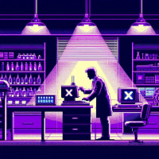

# Foundation X

  

<table style="border:none">
  <tbody>
  <tr>
    <td style="border:none;min-width:205px;text-align:center">
      
    </td>
    <td style="border:none">
      <h3>Demo project for the Foundation-X design system</h3>
      

        A sample design system created to explore architectural patterns and best practices for
        building a true "in-house" React component library.
      

    </td>
  </tr>
  </tbody>
</table>

## A New Beginning(?)

This project was created to act as both a prototype and as the basis for internal demos and presentations.

### Goals

Demonstrate the following concepts:

1. Using Tailwind CSS
2. Leveraging ShadCN UI to create lighter weight components
3. Best practices for ensuring code quality and consistency
